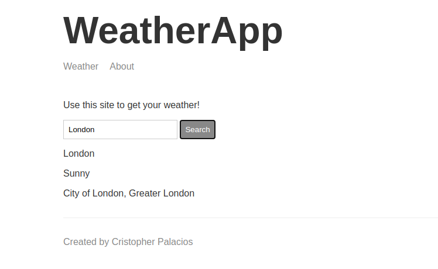

<!--
*** Thanks for checking out this README Template. If you have a suggestion that would
*** make this better, please fork the repo and create a pull request or simply open
*** an issue with the tag "enhancement".
*** Thanks again! Now go create something AMAZING! :D
***
***
***
*** To avoid retyping too much info. Do a search and replace for the following:
*** github_username, repo, twitter_handle, email
-->


<!-- PROJECT SHIELDS -->
<!--
*** I'm using markdown "reference style" links for readability.
*** Reference links are enclosed in brackets [ ] instead of parentheses ( ).
*** See the bottom of this document for the declaration of the reference variables
*** for contributors-url, forks-url, etc. This is an optional, concise syntax you may use.
*** https://www.markdownguide.org/basic-syntax/#reference-style-links
-->

<!-- PROJECT LOGO -->
<br />
<p align="center">
  <a href="https://github.com/github_username/repo">
    
  </a>

  <h3 align="center">WeatherApp</h3>

  <p align="center">
    Short weather App that brings you location and forecast.
  </p>
</p>


<!-- TABLE OF CONTENTS -->
## Table of Contents

* [About the Project](#about-the-project)
* [Built With](#built-with)
* [Getting Started](#getting-started)
  * [Prerequisites](#prerequisites)
  * [Installation](#installation)
* [Usage](#usage)
* [Contact](#contact)


<!-- ABOUT THE PROJECT -->
## About The Project



You just need the name of the country/City Which you wanna check the weather ;)

### Built With

* [Node](https://nodejs.org/en/)
* [Express](https://expressjs.com/en/)
* [Hbs](https://www.npmjs.com/package/hbs)
* [weatherstack](https://weatherstack.com/)
* [html](https://www.tutorialspoint.com/html/html_overview.htm)
* [css](https://skillcrush.com/blog/css)
* [JavaScript](https://developer.mozilla.org/es/docs/Web/JavaScript)


<!-- GETTING STARTED -->
## Getting Started

To get a local copy up and running follow these simple steps.

### Prerequisites

This is an example of how to list things you need to use the software and how to install them.
```
* npm
* Node
* VScodo or any text editor
* An account from weather stack
```

### Installation
 
1. Clone the repo
```
git clone https://github.com/criszelaya24/weatherApp.git
```
2. Install NPM packages
```
npm install
```


<!-- USAGE EXAMPLES -->
## Usage

Once you have installed all the dependencies, run `npm start` and go to your browser and search: `localhost:3000`

<!-- CONTACT -->
## Contact

Cristopher Palacios - [@criszelaya24](https://twitter.com/twitter_handle) - criszelaya24@hotmail.com
